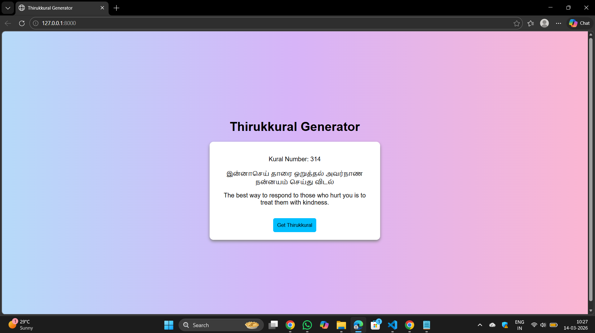
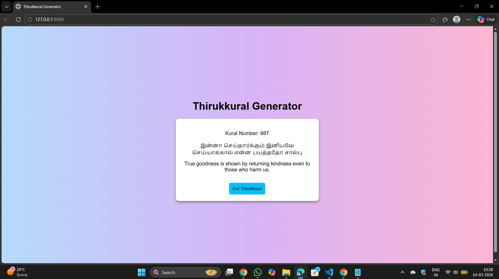
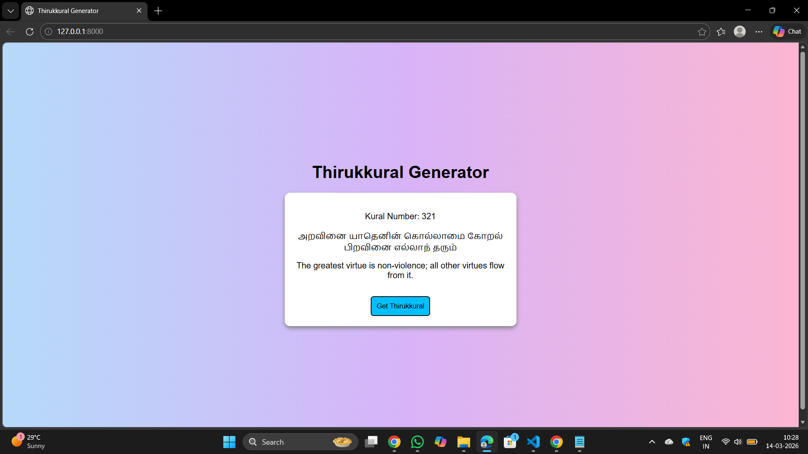
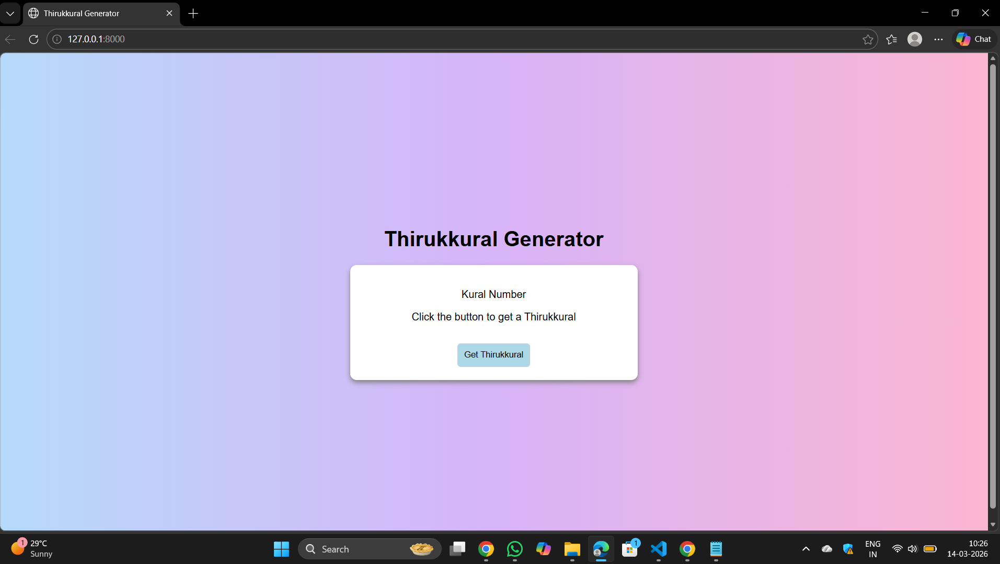

# Quote_Generator
## Date:14/03/2026
## Objective:
To create a simple thirukkural generator using HTML, CSS, and JavaScript that displays a new random thirukkural each time a button is clicked — similar to daily quote sections on blogs or productivity apps.

## Tasks:

### 1. Create the HTML Structure:
<ul>
  <li>Add a heading Thirukkural Generator</li>
  <li>Use a div or p to display the Thirukkural (Tamil couplet).</li>
  <li>Use another p or span to display the meaning or explanation.</li>
  <li>Add a button labeled “Get Thirukkural”.</li>
  <li>Add a label showing the Kural number.</li>
</ul>

### 2. Style the Layout Using CSS:

<ul>
  <li>Center everything on the page using Flexbox.</li>
  <li>Style the quote box with:
  <ul type="square">
    <li>Padding</li>
    <li>Background color</li>
    <li>Rounded borders</li>
    <li>Soft shadow</li>
    <li>Add hover effects for the button.</li>
  </ul>
  </li>
</ul>

### 3. Add JavaScript Functionality:
<ul>
  <li>Store an array of Thirukkural objects containing:
  <ul type="square">
    <li>Kural number</li>
    <li>Kural Meaning</li>
  </ul>
  </li>
  <li>When the button is clicked:
  <ul type="square">
    <li>Generate a random index using Math.random().</li>
    <li>Retrieve the corresponding Thirukkural object.</li>
    <li>Display the Kural number and meaning in the HTML.</li>
    <li>Update content dynamically using innerText.</li>
  </ul>
  </li>
</ul>

## Code:
```
<html>
<head>
<title>Thirukkural Generator</title>

<style>

body{
    font-family: Arial;
    display: flex;
    justify-content: center;
    align-items: center;
    height: 100vh;
    background: linear-gradient(to right, #b6daf9, #d7b4f8, #fbb6d2);
}

.container{
    text-align: center;
}

.box{
    width: 400px;
    padding: 20px;
    background-color:white;
    border-radius: 10px;
    box-shadow: 0px 4px 8px gray;
}

button{
    padding: 10px;
    margin-top: 15px;
    background-color: lightblue;
    border: none;
    border-radius: 5px;
    cursor: pointer;
}

button:hover{
    background-color: deepskyblue;
}

</style>
</head>

<body>

<div class="container">

<h1>Thirukkural Generator</h1>

<div class="box">

<p id="number">Kural Number</p>

<p id="kural">Click the button to get a Thirukkural</p>

<p id="meaning"></p>

<button onclick="showKural()">Get Thirukkural</button>

</div>

</div>

<script>

var kurals = [

{
number: 314,
text: "இன்னாசெய் தாரை ஒறுத்தல் அவர்நாண நன்னயம் செய்து விடல்",
meaning: "The best way to respond to those who hurt you is to treat them with kindness."
},

{
number: 316,
text: "இன்னா செய்தாரை இனியவே செய்யாக்கால் என்ன பயத்ததோ சால்பு",
meaning: "If we cannot return good for evil, what is the use of our goodness?"
},

{
number: 321,
text: "அறவினை யாதெனின் கொல்லாமை கோறல் பிறவினை எல்லாந் தரும்",
meaning: "The greatest virtue is non-violence; all other virtues flow from it."
},

{
number: 323,
text: "ஒன்றாக நல்லது கொல்லாமை மற்றதன் பின்சாரப் பொய்யாமை நன்று",
meaning: "The greatest good is not harming others; next to it comes truthfulness."
},

{
number: 987,
text: "இன்னா செய்தார்க்கும் இனியவே செய்யாக்கால் என்ன பயத்ததோ சால்பு",
meaning: "True goodness is shown by returning kindness even to those who harm us."
}

];

function showKural(){

var random = Math.floor(Math.random() * kurals.length);

document.getElementById("number").innerText = "Kural Number: " + kurals[random].number;

document.getElementById("kural").innerText = kurals[random].text;

document.getElementById("meaning").innerText = kurals[random].meaning;

}

</script>
</body>
</html>

views.py
from django.shortcuts import render

def home(request):
    return render(request, 'thirukkural.html')


urls.py
from django.urls import path
from . import views

urlpatterns = [
    path('', views.home, name='home'),
]
```
## Output:






## Result:
A simple quote generator using HTML, CSS, and JavaScript that displays a new random motivational quote each time a button is clicked — similar to daily quote sections on blogs or productivity apps is created successfully.
